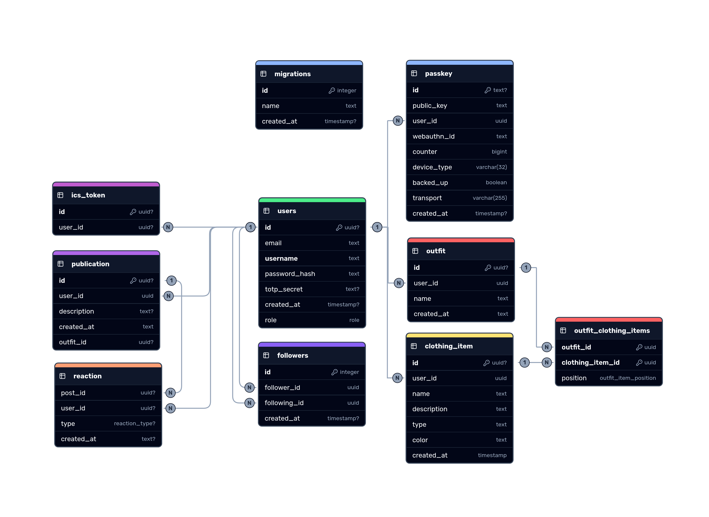

# Contributing to Outfitter

Welcome to Outfitter! This document provides guidelines for setting up your development environment and understanding the project structure.

## Table of Contents

- [Getting Started](#getting-started)
- [Project Structure](#project-structure)
- [Technology Stack](#technology-stack)
- [Database Schema](#database-schema)
- [Development Setup](#development-setup)
- [API Endpoints](#api-endpoints)
- [Authentication](#authentication)
- [Key Modules](#key-modules)

## Getting Started

### Prerequisites

- **Node.js/Bun**: Version specified in [.nvmrc](../.nvmrc)
- **PostgreSQL**: For the database
- **Docker**: For containerized deployment (optional but recommended)

### Quick Start

1. **Clone the repository**

   ```bash
   git clone https://github.com/Outfitter-s/Web outfitter
   cd outfitter
   ```

2. **Install dependencies**

   ```bash
   bun install
   ```

3. **Initialize the database**

   ```bash
   bun run db:migrate
   bun run db:bootstrap
   ```

4. **Start the development server**

   ```bash
   bun run dev
   ```

5. **Access the application**
   Open [http://localhost:5173](http://localhost:5173) in your browser

## Project Structure

```
outfitter/
├── src/
│   ├── routes/              # SvelteKit page routes and API endpoints
│   │   ├── app/            # Authenticated application pages
│   │   ├── api/            # REST API endpoints
│   │   └── (home)/         # Public pages
│   ├── lib/
│   │   ├── components/     # Reusable Svelte components
│   │   ├── server/         # Server-only utilities and database access
│   │   ├── utils/          # Client and shared utilities
│   │   ├── types.ts        # TypeScript type definitions
│   │   ├── i18n.ts         # Internationalization
│   │   └── theming/        # Theme management
│   └── app.css             # Global styles
├── scripts/                # Build and utility scripts
│   ├── db/                # Database-related scripts
│   └── checkTranslations.ts
├── sql/                    # Database migrations and bootstrap
│   ├── migrations/        # Incremental SQL migrations
│   └── bootstrap.sql      # Initial database schema
├── tests/                 # Test files
├── transactional/         # Email templates
├── assets/                # Static assets (clothing items, profile pictures, publications)
├── svelte.config.js       # Svelte configuration
├── vite.config.ts         # Vite configuration
└── package.json
```

## Technology Stack

### Frontend

- **Svelte 5**: Reactive UI framework with rune-based reactivity
- **SvelteKit**: Full-stack framework for routing and SSR
- **TailwindCSS**: Utility-first CSS framework
- **Shadcn Svelte**: Styled UI component library
- **Lucide Svelte**: SVG icon library

### Backend

- **Node.js/Bun**: Runtime environment
- **PostgreSQL**: Relational database
- **JWT**: Token-based authentication
- **bcryptjs**: Password hashing
- **Zod**: Schema validation

### DevTools

- **TypeScript**: Type safety
- **ESLint**: Code linting
- **Prettier**: Code formatting
- **Vitest**: Unit testing
- **Docker**: Containerization

## Database Schema

The application uses PostgreSQL with the following tables:


**Image Storage**: All images are stored in the local filesystem:

- Clothing items: `assets/clothing_item/{id}.png`
- Profile pictures: `assets/profile_pictures/{userId}.png`
- Publications: `assets/publication/{id}.png`

## Development Setup

### Running Scripts

```bash
# Database
bun run db:migrate          # Apply pending migrations
bun run db:bootstrap        # Initialize fresh database
bun run db:create-migration # Create new migration file

# Development
bun run dev                 # Start dev server
bun run build               # Build for production
bun run preview             # Preview production build

# Quality checks
bun run lint                # Run ESLint
bun run format              # Format with Prettier
bun run check               # Run type checking
bun run test                # Run tests
```

## API Endpoints

We mostly use form action when it comes to data transfer from client to server but for convenience, we sometime use API routes, they all are located in [/src/routes/api](../src/routes/api). Some of these routes require authentication. The authentication is handled in [hooks.server.ts](../src/hooks.server.ts).

## Authentication

### JWT-Based Authentication

The application uses JWT tokens stored in HTTP-only cookies:

```typescript
// Token payload
{
  userId: string,
  iat: number,
  exp: number
}
```

### Multi-Factor Authentication

- **TOTP**: Time-based one-time passwords (speakeasy)
- **Passkey**: WebAuthn/FIDO2 authentication (@simplewebauthn)

## Key Modules

### Database Access Objects (DAOs)

Located in `src/lib/server/db/`:

| Module                                                    | Purpose                              |
| --------------------------------------------------------- | ------------------------------------ |
| [`user.ts`](../src/lib/server/db/user.ts)                 | User CRUD operations, authentication |
| [`clothingItem.ts`](../src/lib/server/db/clothingItem.ts) | Wardrobe management                  |
| [`outfit.ts`](../src/lib/server/db/outfit.ts)             | Outfit creation and retrieval        |
| [`publication.ts`](../src/lib/server/db/publication.ts)   | Social posts                         |
| [`social.ts`](../src/lib/server/db/social.ts)             | Follower relationships               |
| [`reaction.ts`](../src/lib/server/db/reaction.ts)         | Post reactions                       |
| [`passkey.ts`](../src/lib/server/db/passkey.ts)           | WebAuthn credentials                 |
| [`ICSToken.ts`](../src/lib/server/db/ICSToken.ts)         | Calendar token management            |

### Utilities

| Module

## Common Development Tasks

### Adding a New Clothing Item Type

1. | Update                                                                    | Purpose                                       |
   | ------------------------------------------------------------------------- | --------------------------------------------- |
   | [`utils/date.ts`](../src/lib/utils/date.ts)                               | Date formatting and manipulation              |
   | [`utils/form.ts`](../src/lib/utils/form.ts)                               | Form validation schemas                       |
   | [`utils/logger.ts`](../src/lib/utils/logger.ts)                           | Logging utility                               |
   | [`utils/portal.svelte.ts`](../src/lib/utils/portal.svelte.ts)             | Portal component helper                       |
   | [`server/mail/index.ts`](../src/lib/server/mail/index.ts)                 | Email template handling                       |
   | [`server/imageProcessing.ts`](../src/lib/server/imageProcessing/index.ts) | Image processing (resize, background removal) |
   | [`server/totp/index.ts`](../src/lib/server/totp/index.ts)                 | TOTP validation                               |

### Components

Key reusable components in `src/lib/components/`:

- **UI Components** (`ui/`): Button, Input, Dialog, Tabs, etc.
- **Social Components** (`social/`): Post, ProfilePicture, Reaction
- **Wardrobe Components** (`wardrobe/`): OutfitItemCard
- **PictureTaker.svelte**: Camera capture and image upload
- **Toast.svelte**: Notification system
